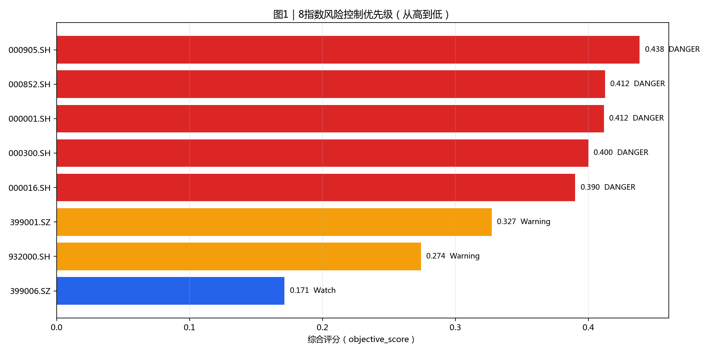
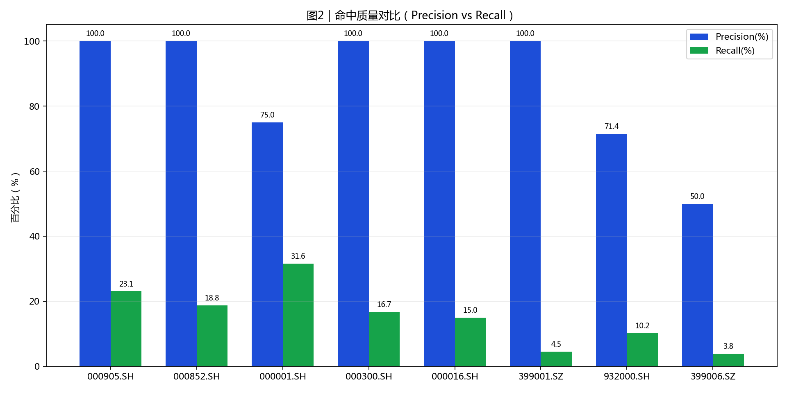
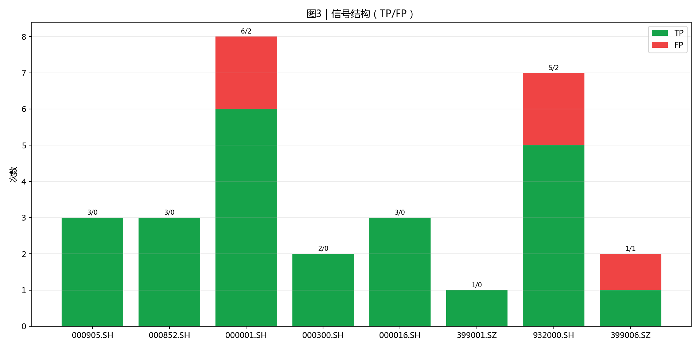
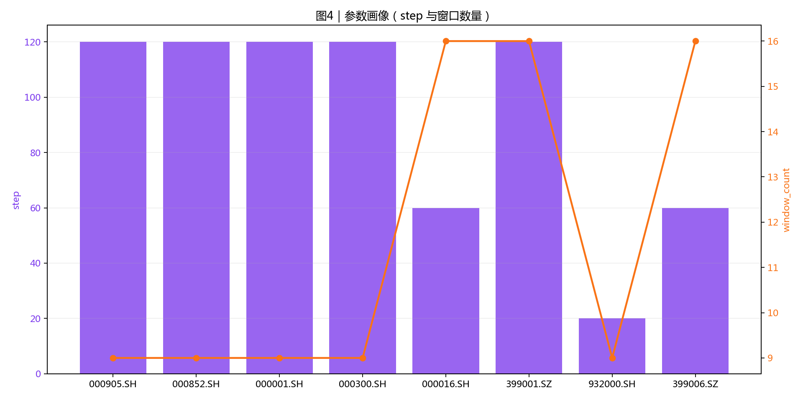

# 8指数风控结果可读报告（优化版）

- 生成时间: 2026-03-29 17:27:55
- 读取模式: `optimal_yaml`（已按指数生效）

## 阅读顺序（30秒）

1. 先看图1确定风险优先级。
2. 再看图2判断误报/漏报平衡。
3. 图3确认信号结构是否健康。
4. 图4用于参数复盘与稳定性观察。

## 执行摘要

- DANGER: 000905.SH, 000852.SH, 000001.SH, 000300.SH, 000016.SH
- Warning: 399001.SZ, 932000.SH
- Watch: 399006.SZ

## 图表

### 图1 风险优先级

### 图2 命中质量

### 图3 信号结构

### 图4 参数画像

## 指数明细（用于执行）

| symbol    | risk_band   | suggest_position   |   objective_score | precision   | recall   | false_positive_rate   |   signal_count |   true_positive |   false_positive |   step |   window_count |
|:----------|:------------|:-------------------|------------------:|:------------|:---------|:----------------------|---------------:|----------------:|-----------------:|-------:|---------------:|
| 000905.SH | DANGER      | 0-20%              |             0.438 | 100.0%      | 23.1%    | 0.0%                  |              3 |               3 |                0 |    120 |              9 |
| 000852.SH | DANGER      | 0-20%              |             0.412 | 100.0%      | 18.8%    | 0.0%                  |              3 |               3 |                0 |    120 |              9 |
| 000001.SH | DANGER      | 0-20%              |             0.412 | 75.0%       | 31.6%    | 2.9%                  |              8 |               6 |                2 |    120 |              9 |
| 000300.SH | DANGER      | 0-20%              |             0.4   | 100.0%      | 16.7%    | 0.0%                  |              2 |               2 |                0 |    120 |              9 |
| 000016.SH | DANGER      | 0-20%              |             0.39  | 100.0%      | 15.0%    | 0.0%                  |              3 |               3 |                0 |     60 |             16 |
| 399001.SZ | Warning     | 30-50%             |             0.327 | 100.0%      | 4.5%     | 0.0%                  |              1 |               1 |                0 |    120 |             16 |
| 932000.SH | Warning     | 30-50%             |             0.274 | 71.4%       | 10.2%    | 1.4%                  |              7 |               5 |                2 |     20 |              9 |
| 399006.SZ | Watch       | 60-80%             |             0.171 | 50.0%       | 3.8%     | 1.6%                  |              2 |               1 |                1 |     60 |             16 |

## 输出可读性优化点

- 所有指标统一百分比展示，降低换算负担。
- 图题和字段中文化，减少术语跳转。
- 指标、图和行动建议保持同一排序。