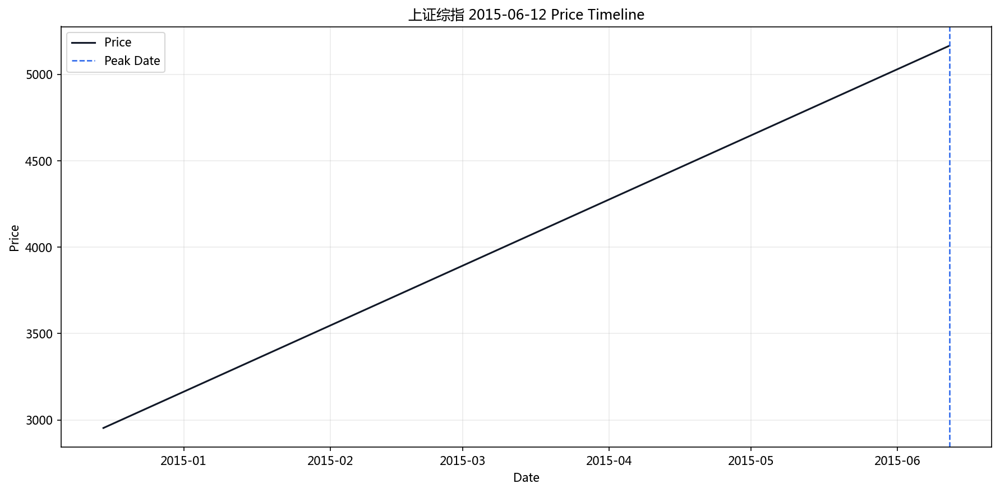
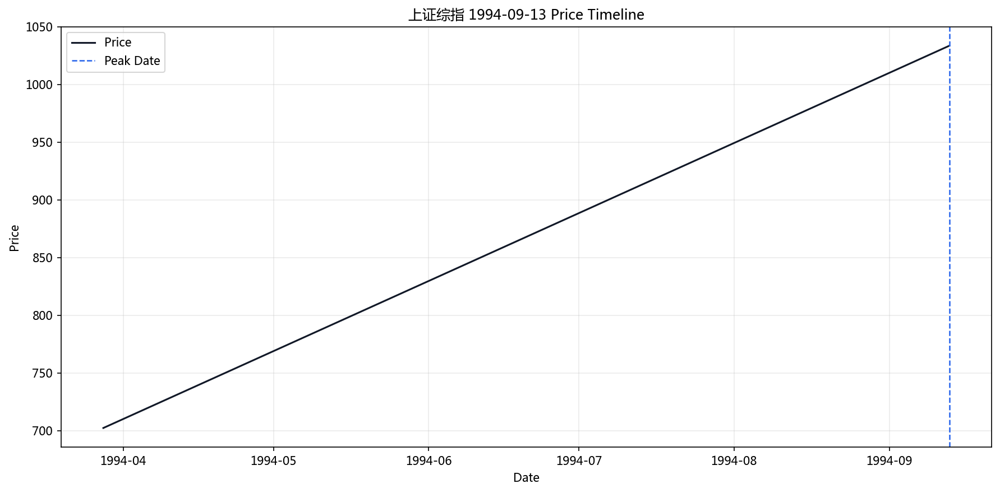
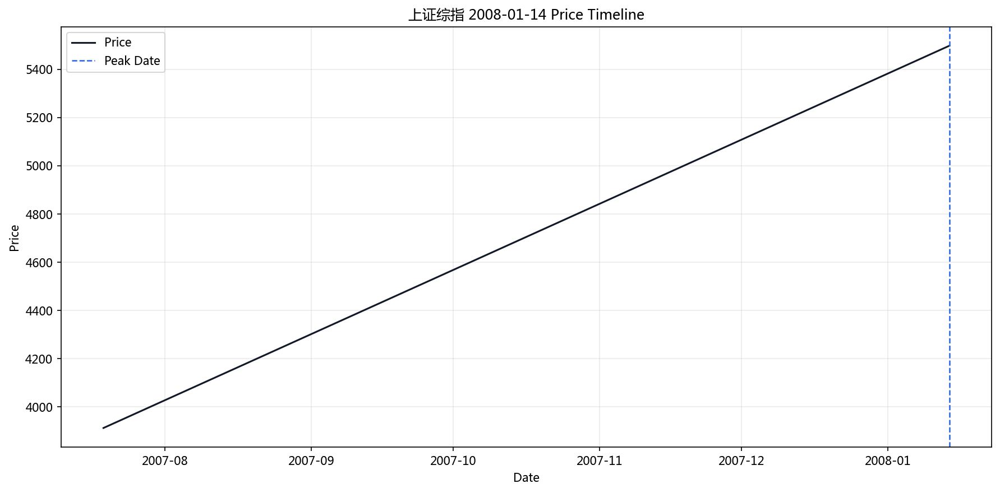
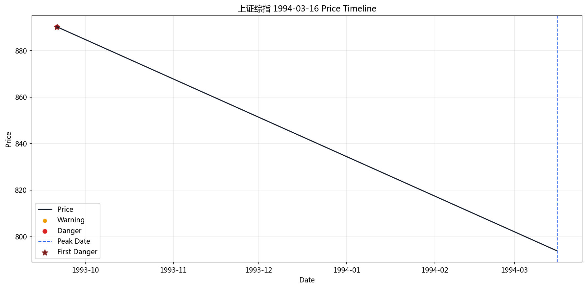
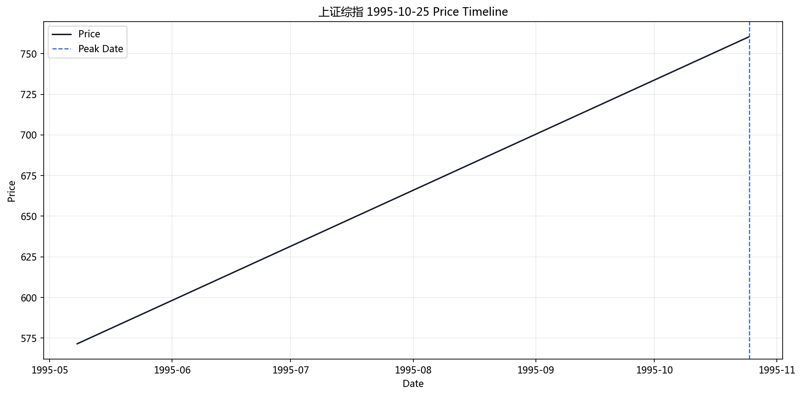
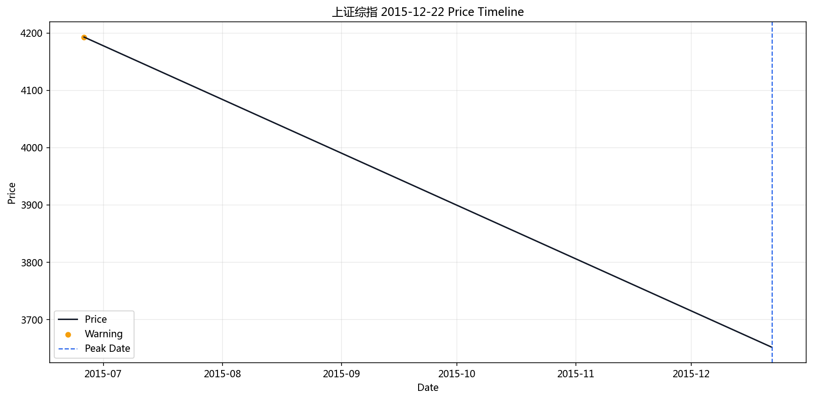
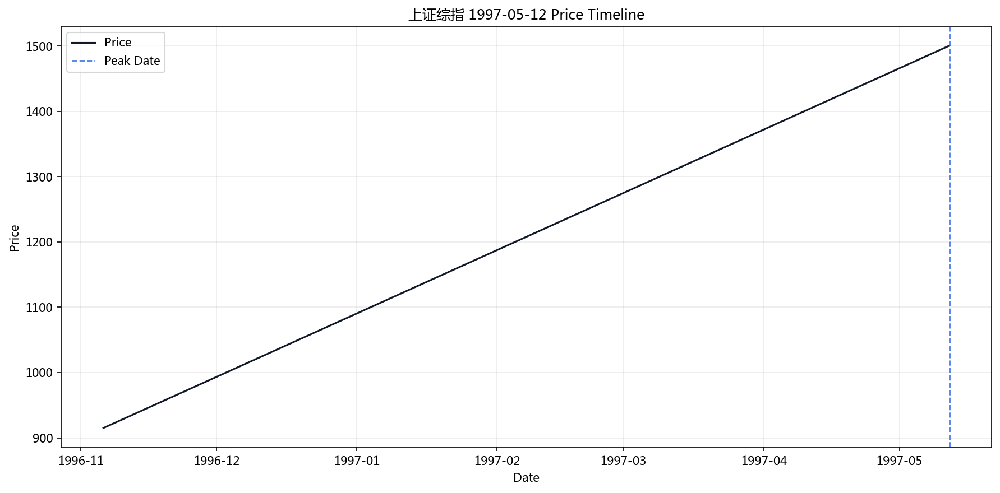
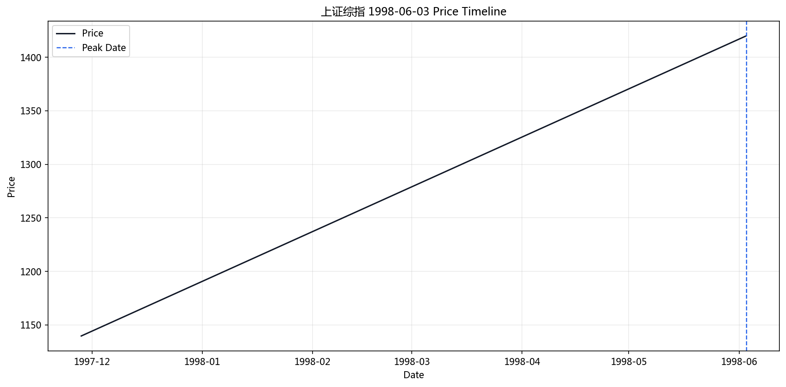
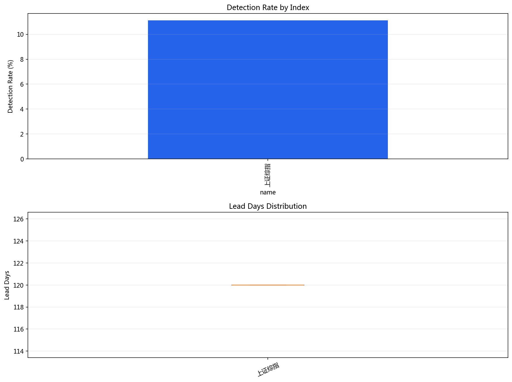

# LPPL 验证报告

**生成时间**: 2026-04-01 20:15:28
**验证模式**: 单窗口独立

## 一、总体结果

- 总样本数: 9
- 检测到预警: 1
- 检测率: 11.1%

## 二、汇总表

|   peak_idx | peak_date   |   peak_price |   total_scans |   danger_count |   danger_before_peak |   first_danger_days |   first_danger_r2 |   first_danger_m |   first_danger_w |   best_trend_days |   best_trend_score |   best_trend_r2 | detected   | mode          | symbol    | name     |   drop_pct | param_source   |   step |   ma_window | optimizer   |   window_count |   window_min |   window_max |   r2_threshold |   consensus_threshold |   danger_days |
|-----------:|:------------|-------------:|--------------:|---------------:|---------------------:|--------------------:|------------------:|-----------------:|-----------------:|------------------:|-------------------:|----------------:|:-----------|:--------------|:----------|:---------|-----------:|:---------------|-------:|------------:|:------------|---------------:|-------------:|-------------:|---------------:|----------------------:|--------------:|
|       5709 | 2015-06-12  |      5166.35 |             2 |              0 |                    0 |                 nan |        nan        |       nan        |        nan       |               nan |         nan        |      nan        | False      | single_window | 000001.SH | 上证综指 |   0.433393 | optimal_yaml   |    120 |           5 | lbfgsb      |              9 |           40 |          120 |            0.5 |                   0.2 |            20 |
|        687 | 1994-09-13  |      1033.47 |             2 |              0 |                    0 |                 nan |        nan        |       nan        |        nan       |               nan |         nan        |      nan        | False      | single_window | 000001.SH | 上证综指 |   0.403621 | optimal_yaml   |    120 |           5 | lbfgsb      |              9 |           40 |          120 |            0.5 |                   0.2 |            20 |
|       3908 | 2008-01-14  |      5497.9  |             2 |              0 |                    0 |                 nan |        nan        |       nan        |        nan       |               nan |         nan        |      nan        | False      | single_window | 000001.SH | 上证综指 |   0.400377 | optimal_yaml   |    120 |           5 | lbfgsb      |              9 |           40 |          120 |            0.5 |                   0.2 |            20 |
|        559 | 1994-03-16  |       793.87 |             2 |              1 |                    1 |                -120 |          0.529224 |         0.693085 |          8.00307 |              -120 |           0.105845 |        0.529224 | True       | single_window | 000001.SH | 上证综指 |   0.341202 | optimal_yaml   |    120 |           5 | lbfgsb      |              9 |           40 |          120 |            0.5 |                   0.2 |            20 |
|        967 | 1995-10-25  |       760.41 |             2 |              0 |                    0 |                 nan |        nan        |       nan        |        nan       |               nan |         nan        |      nan        | False      | single_window | 000001.SH | 上证综指 |   0.320814 | optimal_yaml   |    120 |           5 | lbfgsb      |              9 |           40 |          120 |            0.5 |                   0.2 |            20 |
|       5838 | 2015-12-22  |      3651.77 |             2 |              0 |                    0 |                 nan |        nan        |       nan        |        nan       |               nan |         nan        |      nan        | False      | single_window | 000001.SH | 上证综指 |   0.272775 | optimal_yaml   |    120 |           5 | lbfgsb      |              9 |           40 |          120 |            0.5 |                   0.2 |            20 |
|       1327 | 1997-05-12  |      1500.39 |             2 |              0 |                    0 |                 nan |        nan        |       nan        |        nan       |               nan |         nan        |      nan        | False      | single_window | 000001.SH | 上证综指 |   0.268983 | optimal_yaml   |    120 |           5 | lbfgsb      |              9 |           40 |          120 |            0.5 |                   0.2 |            20 |
|       4456 | 2010-04-14  |      3166.18 |             2 |              0 |                    0 |                 nan |        nan        |       nan        |        nan       |               nan |         nan        |      nan        | False      | single_window | 000001.SH | 上证综指 |   0.253375 | optimal_yaml   |    120 |           5 | lbfgsb      |              9 |           40 |          120 |            0.5 |                   0.2 |            20 |
|       1586 | 1998-06-03  |      1420    |             2 |              0 |                    0 |                 nan |        nan        |       nan        |        nan       |               nan |         nan        |      nan        | False      | single_window | 000001.SH | 上证综指 |   0.24619  | optimal_yaml   |    120 |           5 | lbfgsb      |              9 |           40 |          120 |            0.5 |                   0.2 |            20 |

## 三、图片输出

### 案例价格时间线图

### 汇总统计图

