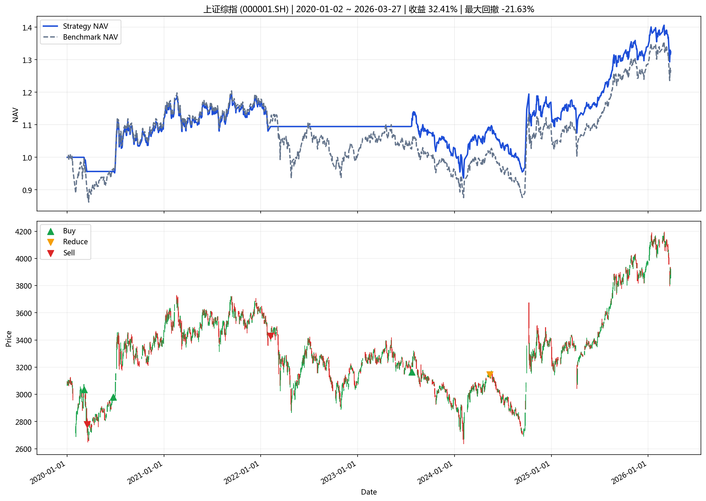
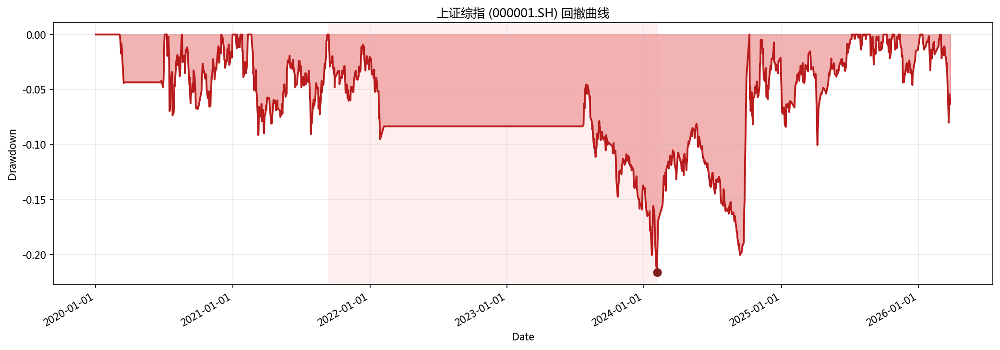

# 指数投资分析报告

**生成时间**: 2026-04-01 20:40:49

## 一、策略摘要

### 上证综指 (000001.SH)

- 回测区间: 2020-01-02 ~ 2026-03-27
- 最新信号: none
- 最新动作: hold
- 最终净值: 1.3241
- 策略收益: 32.41%
- 基准收益: 26.85%
- 最大回撤: -21.63%
- 交易次数: 6

## 二、汇总表

|   final_nav |   total_return |   benchmark_return |   annualized_return |   annualized_excess_return |   calmar_ratio |   max_drawdown |   trade_count |   signal_count |   average_position |   turnover_rate |   whipsaw_rate | latest_action   | latest_signal   | start_date   | end_date   | symbol    | name     | mode          | param_source   |   step |
|------------:|---------------:|-------------------:|--------------------:|---------------------------:|---------------:|---------------:|--------------:|---------------:|-------------------:|----------------:|---------------:|:----------------|:----------------|:-------------|:-----------|:----------|:---------|:--------------|:---------------|-------:|
|     1.32415 |       0.324145 |           0.268547 |           0.0480042 |                  0.0074805 |       0.221931 |      -0.216302 |             6 |              6 |           0.657794 |         4.29736 |              0 | hold            | none            | 2020-01-02   | 2026-03-27 | 000001.SH | 上证综指 | single_window | optimal_yaml   |    120 |

## 三、图表

### 核心图表

