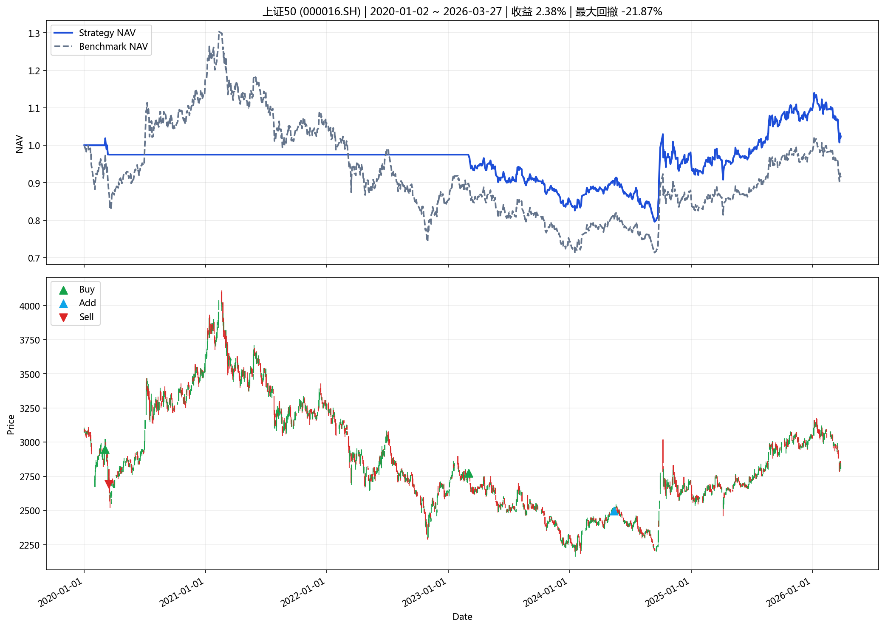
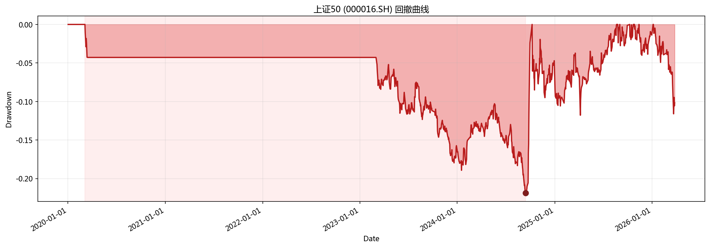

# 指数投资分析报告

**生成时间**: 2026-04-01 20:40:49

## 一、策略摘要

### 上证50 (000016.SH)

- 回测区间: 2020-01-02 ~ 2026-03-27
- 最新信号: none
- 最新动作: hold
- 最终净值: 1.0238
- 策略收益: 2.38%
- 基准收益: -8.20%
- 最大回撤: -21.87%
- 交易次数: 4

## 二、汇总表

|   final_nav |   total_return |   benchmark_return |   annualized_return |   annualized_excess_return |   calmar_ratio |   max_drawdown |   trade_count |   signal_count |   average_position |   turnover_rate |   whipsaw_rate | latest_action   | latest_signal   | start_date   | end_date   | symbol    | name   | mode          | param_source   |   step |
|------------:|---------------:|-------------------:|--------------------:|---------------------------:|---------------:|---------------:|--------------:|---------------:|-------------------:|----------------:|---------------:|:----------------|:----------------|:-------------|:-----------|:----------|:-------|:--------------|:---------------|-------:|
|     1.02379 |      0.0237943 |         -0.0820233 |          0.00393478 |                  0.0181254 |      0.0179902 |      -0.218718 |             4 |              4 |           0.439667 |         2.10784 |              0 | hold            | none            | 2020-01-02   | 2026-03-27 | 000016.SH | 上证50 | single_window | optimal_yaml   |     60 |

## 三、图表

### 核心图表

