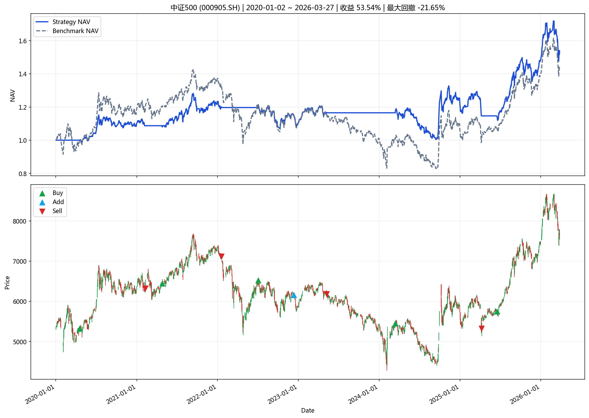
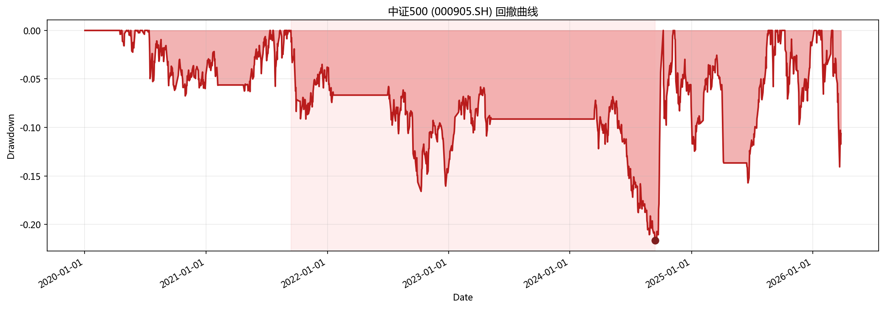

# 指数投资分析报告

**生成时间**: 2026-04-01 20:40:49

## 一、策略摘要

### 中证500 (000905.SH)

- 回测区间: 2020-01-02 ~ 2026-03-27
- 最新信号: none
- 最新动作: hold
- 最终净值: 1.5354
- 策略收益: 53.54%
- 基准收益: 44.19%
- 最大回撤: -21.65%
- 交易次数: 10

## 二、汇总表

|   final_nav |   total_return |   benchmark_return |   annualized_return |   annualized_excess_return |   calmar_ratio |   max_drawdown |   trade_count |   signal_count |   average_position |   turnover_rate |   whipsaw_rate | latest_action   | latest_signal   | start_date   | end_date   | symbol    | name    | mode          | param_source   |   step |
|------------:|---------------:|-------------------:|--------------------:|---------------------------:|---------------:|---------------:|--------------:|---------------:|-------------------:|----------------:|---------------:|:----------------|:----------------|:-------------|:-----------|:----------|:--------|:--------------|:---------------|-------:|
|     1.53544 |       0.535444 |           0.441932 |           0.0742384 |                  0.0112135 |       0.342916 |      -0.216492 |            10 |             10 |           0.578436 |         8.76912 |              0 | hold            | none            | 2020-01-02   | 2026-03-27 | 000905.SH | 中证500 | single_window | optimal_yaml   |    120 |

## 三、图表

### 核心图表

