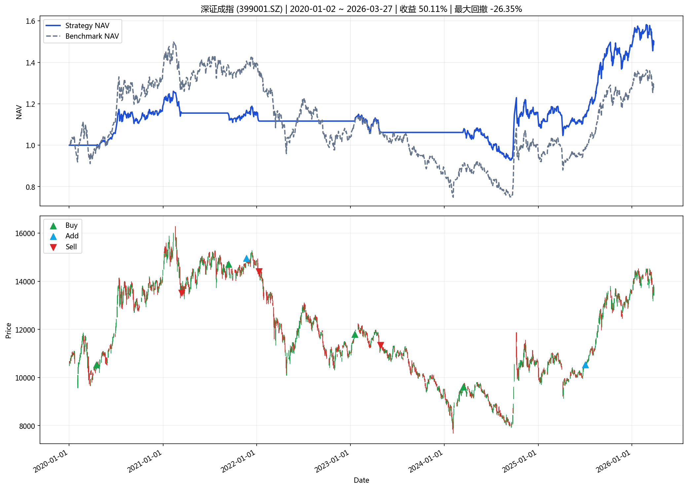
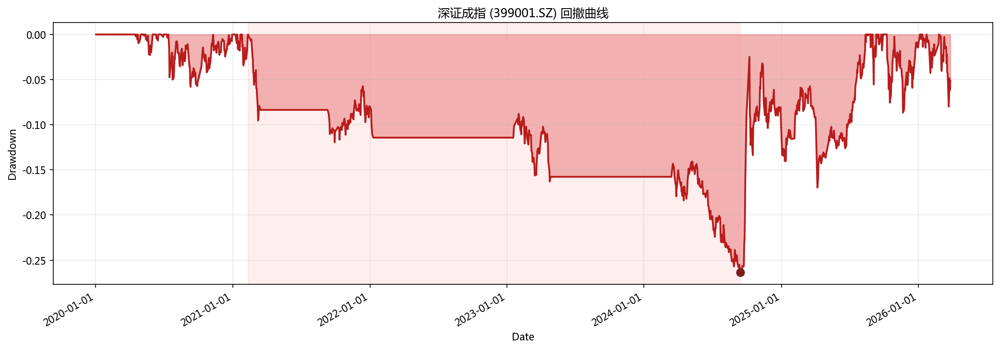

# 指数投资分析报告

**生成时间**: 2026-04-01 20:40:49

## 一、策略摘要

### 深证成指 (399001.SZ)

- 回测区间: 2020-01-02 ~ 2026-03-27
- 最新信号: none
- 最新动作: hold
- 最终净值: 1.5011
- 策略收益: 50.11%
- 基准收益: 29.34%
- 最大回撤: -26.35%
- 交易次数: 9

## 二、汇总表

|   final_nav |   total_return |   benchmark_return |   annualized_return |   annualized_excess_return |   calmar_ratio |   max_drawdown |   trade_count |   signal_count |   average_position |   turnover_rate |   whipsaw_rate | latest_action   | latest_signal   | start_date   | end_date   | symbol    | name     | mode          | param_source   |   step |
|------------:|---------------:|-------------------:|--------------------:|---------------------------:|---------------:|---------------:|--------------:|---------------:|-------------------:|----------------:|---------------:|:----------------|:----------------|:-------------|:-----------|:----------|:---------|:--------------|:---------------|-------:|
|     1.50113 |       0.501127 |           0.293411 |           0.0701912 |                   0.026289 |       0.266393 |      -0.263488 |             9 |              9 |            0.45068 |         6.66192 |              0 | hold            | none            | 2020-01-02   | 2026-03-27 | 399001.SZ | 深证成指 | single_window | optimal_yaml   |    120 |

## 三、图表

### 核心图表

