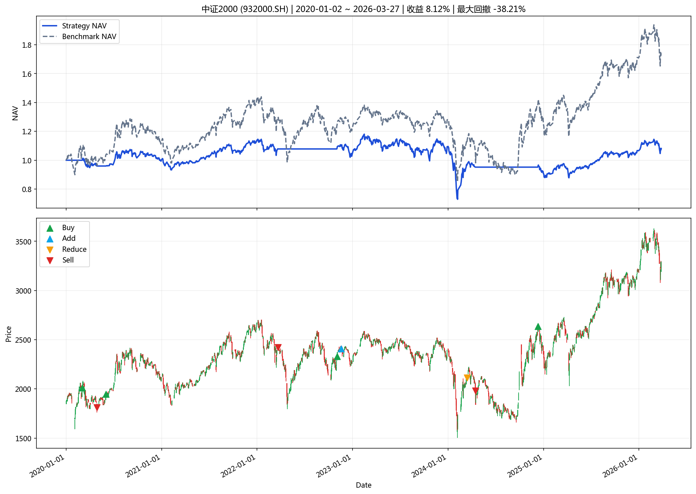
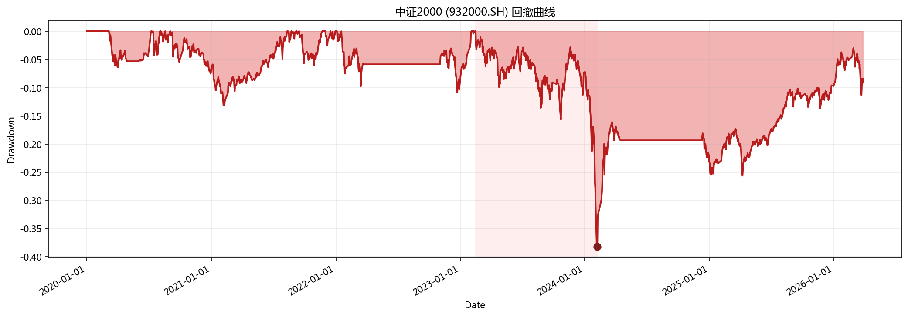

# 指数投资分析报告

**生成时间**: 2026-04-01 19:11:49

## 一、策略摘要

### 中证2000 (932000.SH)

- 回测区间: 2020-01-02 ~ 2026-03-27
- 最新信号: none
- 最新动作: hold
- 最终净值: 1.0812
- 策略收益: 8.12%
- 基准收益: 75.31%
- 最大回撤: -38.21%
- 交易次数: 9

## 二、汇总表

|   final_nav |   total_return |   benchmark_return |   annualized_return |   annualized_excess_return |   calmar_ratio |   max_drawdown |   trade_count |   signal_count |   average_position |   turnover_rate |   whipsaw_rate | latest_action   | latest_signal   | start_date   | end_date   | symbol    | name     | mode          | param_source   |   step |
|------------:|---------------:|-------------------:|--------------------:|---------------------------:|---------------:|---------------:|--------------:|---------------:|-------------------:|----------------:|---------------:|:----------------|:----------------|:-------------|:-----------|:----------|:---------|:--------------|:---------------|-------:|
|     1.08118 |      0.0811767 |           0.753074 |           0.0131195 |                 -0.0851632 |      0.0343371 |       -0.38208 |             9 |              9 |           0.498963 |         4.54445 |              0 | hold            | none            | 2020-01-02   | 2026-03-27 | 932000.SH | 中证2000 | single_window | optimal_yaml   |     20 |

## 三、图表

### 核心图表

