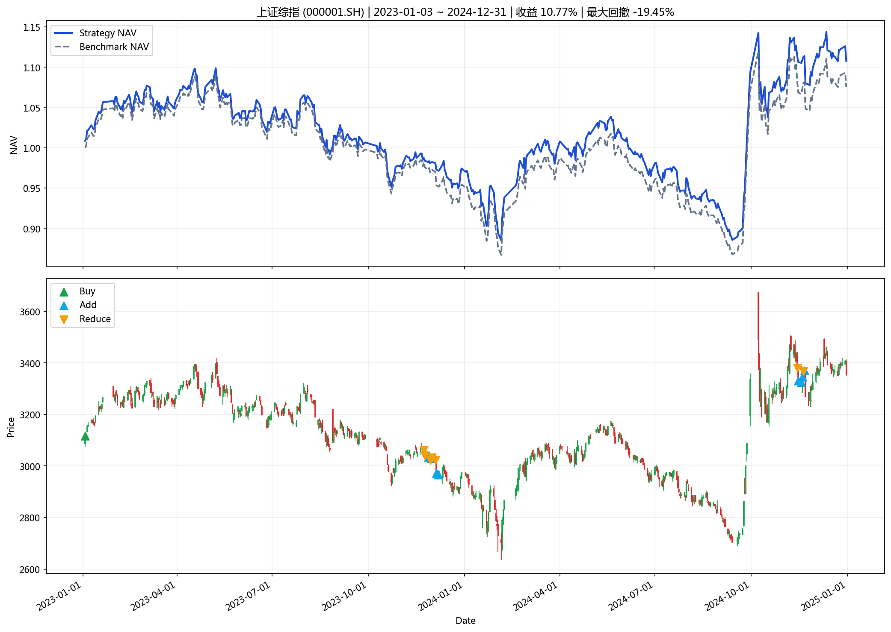
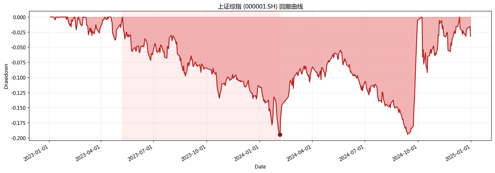

# 指数投资分析报告

**生成时间**: 2026-03-29 18:35:43

## 一、策略摘要

### 上证综指 (000001.SH)

- 回测区间: 2023-01-03 ~ 2024-12-31
- 最新信号: none
- 最新动作: hold
- 最终净值: 1.1077
- 策略收益: 10.77%
- 基准收益: 7.55%
- 最大回撤: -19.45%
- 交易次数: 18

## 二、汇总表

|   final_nav |   total_return |   benchmark_return |   annualized_return |   max_drawdown |   trade_count |   signal_count |   average_position | latest_action   | latest_signal   | start_date   | end_date   | symbol    | name     | mode          | param_source   |   step |
|------------:|---------------:|-------------------:|--------------------:|---------------:|--------------:|---------------:|-------------------:|:----------------|:----------------|:-------------|:-----------|:----------|:---------|:--------------|:---------------|-------:|
|     1.10769 |       0.107693 |          0.0754851 |           0.0546965 |      -0.194537 |            18 |              5 |           0.984486 | hold            | none            | 2023-01-03   | 2024-12-31 | 000001.SH | 上证综指 | single_window | default_cli    |      5 |

## 三、图表

### 核心图表

