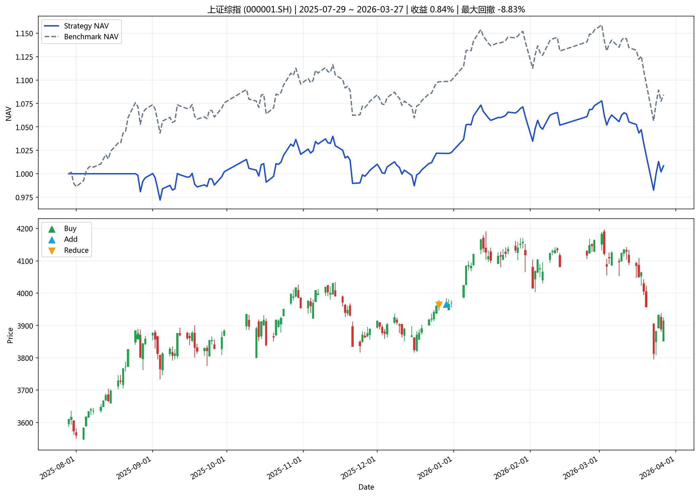
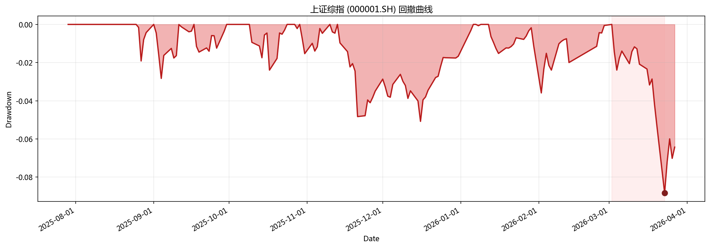

# 指数投资分析报告

**生成时间**: 2026-03-29 18:29:22

## 一、策略摘要

### 上证综指 (000001.SH)

- 回测区间: 2025-07-29 ~ 2026-03-27
- 最新信号: negative_bubble
- 最新动作: hold
- 最终净值: 1.0084
- 策略收益: 0.84%
- 基准收益: 8.42%
- 最大回撤: -8.83%
- 交易次数: 3

## 二、汇总表

|   final_nav |   total_return |   benchmark_return |   annualized_return |   max_drawdown |   trade_count |   signal_count |   average_position | latest_action   | latest_signal   | start_date   | end_date   | symbol    | name     | mode          | param_source   |   step |
|------------:|---------------:|-------------------:|--------------------:|---------------:|--------------:|---------------:|-------------------:|:----------------|:----------------|:-------------|:-----------|:----------|:---------|:--------------|:---------------|-------:|
|     1.00843 |     0.00842925 |          0.0842201 |           0.0133082 |      -0.088297 |             3 |              3 |           0.871877 | hold            | negative_bubble | 2025-07-29   | 2026-03-27 | 000001.SH | 上证综指 | single_window | default_cli    |      5 |

## 三、图表

### 核心图表

