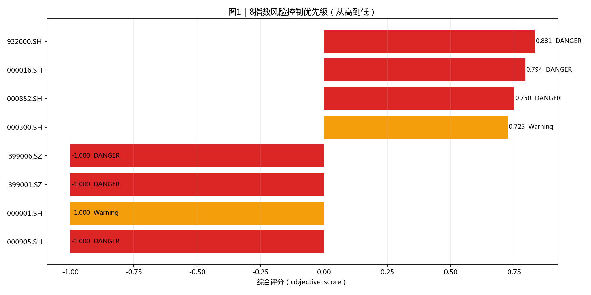
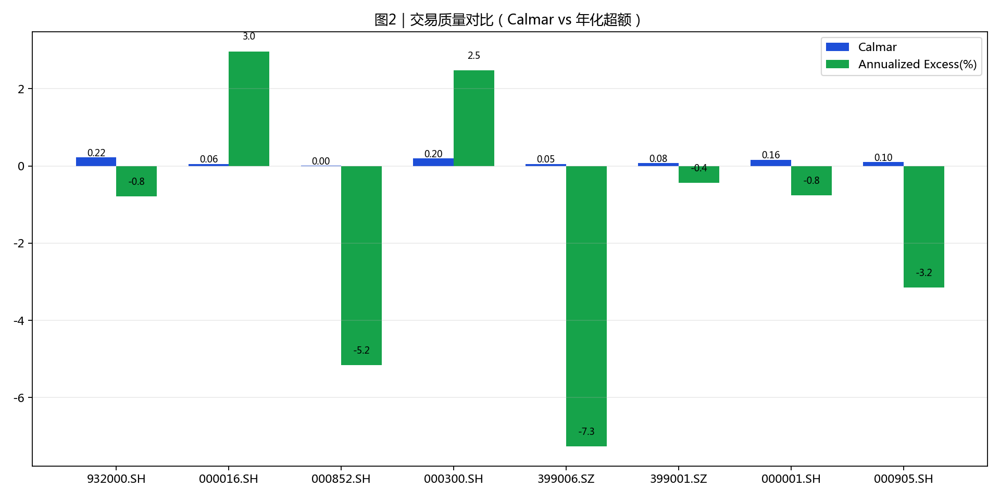
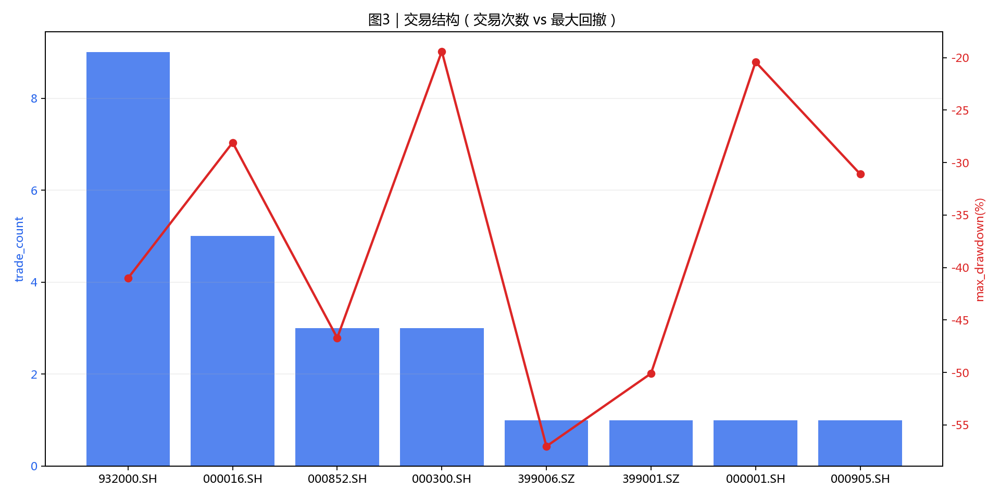
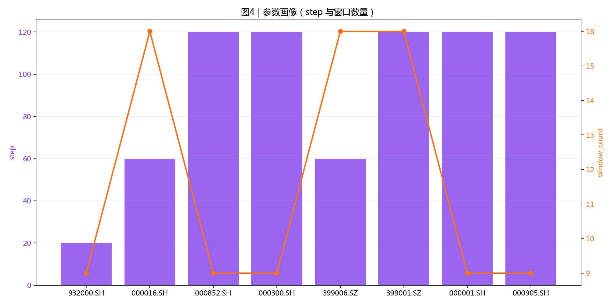

# 8指数风控结果可读报告（优化版）

- 生成时间: 2026-03-29 19:15:23
- 读取模式: `optimal_yaml`（已按指数生效）

## 阅读顺序（30秒）

1. 先看图1确定风险优先级。
2. 再看图2判断误报/漏报平衡。
3. 图3确认信号结构是否健康。
4. 图4用于参数复盘与稳定性观察。

## 执行摘要

- DANGER: 932000.SH, 000016.SH, 000852.SH, 399006.SZ, 399001.SZ, 000905.SH
- Warning: 000300.SH, 000001.SH
- Watch: 无

## 图表

### 图1 风险优先级

### 图2 命中质量

### 图3 信号结构

### 图4 参数画像

## 指数明细（用于执行）

| symbol    | risk_band   | suggest_position   |   objective_score | annualized_excess_return   |   calmar_ratio | max_drawdown   |   trade_count | turnover_rate   | whipsaw_rate   |   signal_count |   step |   window_count |
|:----------|:------------|:-------------------|------------------:|:---------------------------|---------------:|:---------------|--------------:|:----------------|:---------------|---------------:|-------:|---------------:|
| 932000.SH | DANGER      | 0-20%              |             0.831 | -0.8%                      |           0.22 | -41.0%         |             9 | 1122.0%         | 0.0%           |              9 |     20 |              9 |
| 000016.SH | DANGER      | 0-20%              |             0.794 | 3.0%                       |           0.06 | -28.1%         |             5 | 539.4%          | 0.0%           |              5 |     60 |             16 |
| 000852.SH | DANGER      | 0-20%              |             0.75  | -5.2%                      |           0    | -46.7%         |             3 | 242.3%          | 0.0%           |              3 |    120 |              9 |
| 000300.SH | Warning     | 20-40%             |             0.725 | 2.5%                       |           0.2  | -19.4%         |             3 | 318.0%          | 0.0%           |              3 |    120 |              9 |
| 399006.SZ | DANGER      | 0-20%              |            -1     | -7.3%                      |           0.05 | -57.0%         |             1 | 100.0%          | 0.0%           |              1 |     60 |             16 |
| 399001.SZ | DANGER      | 0-20%              |            -1     | -0.4%                      |           0.08 | -50.1%         |             1 | 100.0%          | 0.0%           |              1 |    120 |             16 |
| 000001.SH | Warning     | 20-40%             |            -1     | -0.8%                      |           0.16 | -20.4%         |             1 | 100.0%          | 0.0%           |              1 |    120 |              9 |
| 000905.SH | DANGER      | 0-20%              |            -1     | -3.2%                      |           0.1  | -31.1%         |             1 | 100.0%          | 0.0%           |              1 |    120 |              9 |

## 输出可读性优化点

- 所有指标统一百分比展示，降低换算负担。
- 图题和字段中文化，减少术语跳转。
- 指标、图和行动建议保持同一排序。